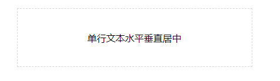
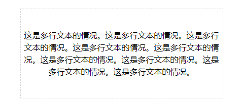
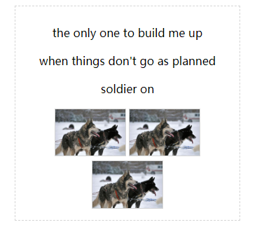
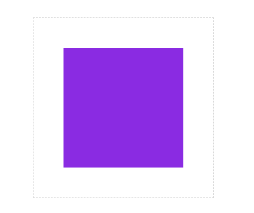

# 前端小贴士 -- 元素水平垂直居中方案总结

### 一、前言

  &emsp;&emsp;在前端开发的过程中，元素水平垂直居中的场景是非常常见的。

  &emsp;&emsp;根据元素是块级元素还是内联元素，或者根据其容器的性质不同，可以采用不同的水平垂直居中方案。

### 二、单行文本

  &emsp;&emsp;对于容器内单行文本，可以通过text-align和line-height属性实现水平垂直居中：

```CSS
.single-text-container {
  width: 400px;
  height: 100px;
  margin: 0 auto;
  border: 1px dashed rgb(213,213,213);
  box-sizing: border-box;
  text-align: center;
  line-height: 100px;
}
```

  &emsp;&emsp;HTML结构为：

```html
  <div class="single-text-container">
    <span>单行文本水平垂直居中</span>
  </div>
```

  

### 三、内联元素的复杂情况

  &emsp;&emsp;面对多行文本时，上述示例的方法就不管用了。这时可以采用padding来代替line-height：

```css
.single-text-container-1 {
  width: 400px;
  margin: 0 auto;
  border: 1px dashed rgb(213,213,213);
  box-sizing: border-box;
  text-align: center;
  padding: 40px 0;
}
```

  

  &emsp;&emsp;css中还有一种特殊的内联块级元素，比如常见的img标签。如果容器内包含任意的文本和图片，情况就变得复杂多了，这时可以采用table-cell布局方式处理。

```html
  <div class="complex-inline-container">
    <p>the only one to build me up</p>
    <p>when things don't go as planned</p>
    <p>soldier on</p>
    
    
    
  </div>
```

  

```css
.complex-inline-container {
  position: relative;
  display: table-cell;
  text-align: center;
  vertical-align: middle;
  width: 300px;
  padding: 10px;
  margin: 0 auto;
  border: 1px dashed rgb(213,213,213);
}
```

### 三、块级元素

  &emsp;&emsp;首先对于已知块级元素高度和宽度的情况，可以采用定位（absolute 或者 relative + top + left）和负margin来处理：

```html
<div class="square-container">
  <div class="square demo5"></div>
</div>
```

  

```css
.square-container {
  position: relative;
  width: 300px;
  height: 300px;
  margin: 0 auto;
  border: 1px dashed rgb(213,213,213);
}
.square {
  width: 200px;
  height: 200px;
  background-color: blueviolet;
}
.demo5 {
  position: relative;
  top: 50%;
  left: 50%;
  margin-left: -100px;
  margin-top: -100px;
}
```

  &emsp;&emsp;上述css代码主要通过top和left让元素向下和向右偏移父级元素高度和宽度的一半，再通过负margin往反方向偏移自身宽高的一半，实现元素的水平垂直居中。

  &emsp;&emsp;那么如果我们并不知道元素的宽高，则没有办法设置margin的值。这里可以采用transform中的translate代替，因为translate属性中的百分比是相对于自身的宽高。

```css
.demo6 {
  position: relative;
  top: 50%;
  left: 50%;
  transform: translate(-50%,-50%);
}
```

### 四、Flexible Box Layout

  &emsp;&emsp;CSS3中新增的Flexible Box Layout可以很轻松的处理元素的水平垂直居中。

  &emsp;&emsp;以上述块级元素为例：

```css
.flex-container {
  display: flex;
  flex-flow: row nowrap;
  align-items: center;
  justify-content: center;
  margin: 0 auto;
  width: 300px;
  height: 300px;
  border: 1px dashed rgb(213,213,213);
}
```

  &emsp;&emsp;当然Flex的功能并不仅仅体现在水平垂直居中的场景，如果你对Flex还不熟悉的话，可以先看看下面两篇文章：
  - [Flex的基本语法](http://www.ruanyifeng.com/blog/2015/07/flex-grammar.html)
  - [Flex的实践示例](http://www.ruanyifeng.com/blog/2015/07/flex-examples.html)

### 五、Grid Layout

  &emsp;&emsp;CSS3中还新增了Grid Layout语法，同样以上述块级元素为例：

```html
<div class="grid-container">
  <div class="square grid-item"></div>
</div>
```

```css
.grid-container {
  display: grid;
  margin: 0 auto;
  width: 300px;
  height: 300px;
  border: 1px dashed rgb(213,213,213);
}
.grid-item {
  margin: auto;
}
```

  &emsp;&emsp;在普通的布局方式上，margin的auto只能作用在水平方向，而在Grid Layout中auto居然可以作用于水平和垂直方向，是不是很神奇。如果你想更深入的了解Grid Layout，可以阅读[全面认识Grid Layout](https://juejin.im/post/5bafb20f518825573058337d)

### 六、总结

  &emsp;&emsp;现在可以知晓元素水平垂直居中的方案有：

  - line-height + text-align
  - padding + text-align
  - table-cell + text-align + vertical-align
  - position(relative，absolute) + left + top + margin
  - position(relative，absolute) + left + top + translate
  - Flex
  - Grid

  &emsp;&emsp;前五种针对性比较强，而后两种方案主要是CSS3中新增的布局语法，应用的场景更加广泛。