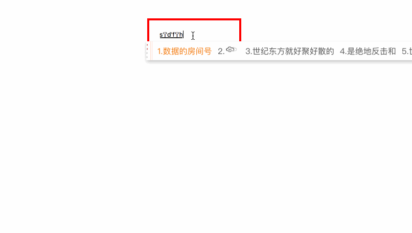

### 如何实现一个尺寸“听话”的多行输入框

### 一、前言

  &emsp;&emsp;通过创建 textarea 标签，并且指定其 rows 和 cols 属性，就可以创建一个多行文本输入框。

  &emsp;&emsp;但是当输入的内容超过指定的 rows 之后，就会出现滚动条，如果用户想要查看全部内容，那就必须来回的拖动滚动条。而且这个滚动条只有在用户滚动的时候才会出现，在一些情况下，用户可能并不知道该区域有更多的内容。

  &emsp;&emsp;通常情况下，为了给用户一个良好的体验，需要让这个多行输入框的高度自适应，从而避免滚动条带来的问题。


### 二、高度自适应

  &emsp;&emsp;实现高度自适应的输入框的思路很简单：监听输入相关的事件，获取到元素的内容高度，修改 textarea 的固定高度。

  &emsp;&emsp;其中涉及很多基础的知识，也就是我们常说的细节问题处理：

##### 1、scrollHeight

  &emsp;&emsp;scrollHeight 这个只读属性是一个元素内容高度的度量，包括由于溢出的视图中不可见的内容。

  &emsp;&emsp;scrollHeight 包含元素的padding，但是不包含元素的 border 和 margin 。当元素中不存在溢出内容，则 scrollHeight 与 clientHeight 是相同的。

  &emsp;&emsp;接下来只要将获取到的 scrollHeight 属性值赋给元素样式中的 height 属性，就可以动态的更改高度了，但是事情并没有那么简单，这里又要引出另一个基础知识点。

##### 2、box-sizing

  &emsp;&emsp;CSS 中的盒模型基本上是常考的一个知识点，CSS3中可以通过设置 box-sizing 属性值，从而更改盒模型高度和宽度的计算，下面以高度为例：

  - content-box：是默认值。如果你设置一个元素的高度为100px，意味着元素内容区域的高度为100px，如果再设置 padding 和 border ，那么最终元素的高度为 100px + border-top + border-bottom + padding-top + padding-bottom 。
  - border-box：如果你设置一个元素的高度为100px，则意味着元素的最终高度就是100px，而元素内容区域的高度为 100px - border-top - border-bottom - padding-top - padding-bottom 。

  &emsp;&emsp;由此可见，为元素设置样式中的 height 属性时，需要弄清楚元素的 box-sizing 、 padding 以及 border。

##### 3、getComputedStyle

  &emsp;&emsp;对于前端新手来说，要获取到元素样式的 height 属性值，可能第一时间会想到：

```JavaScript
  document.getElementById('demo').style.height
```

  &emsp;&emsp;但是大部分情况下，该属性获取的是空值，因为它只能够获取行内样式，如果 style 属性中并没有设置 height 属性值，那自然就是空值。

  &emsp;&emsp;在 CSS 中，开发者可以通过很多方式去设置元素的样式，并且它们的优先级各不相同，那么就需要一个 API 来确定元素最终的样式，而 Window.getComputedStyle() 方法正是因此而生。

  &emsp;&emsp;Window.getComputedStyle() 方法返回一个实时的 CSSStyleDeclaration 对象，通过调用其 getPropertyValue() 方法，获取相应的属性值：

```JavaScript
  const style = window.getComputedStyle(el)
  style.getPropertyValue('box-sizing')
```

##### 4、实现

```JavaScript
function AutoSize (el) {
  if (!(this instanceof AutoSize)) {
    return new AutoSize(el)
  }
  if (!el) {
    throw new Error('element can not be empty')
  }
  if (typeof el === 'string') {
    el = document.querySelector(el)
  }
  this.el = el
  const attrs = ['box-sizing', 'padding-top', 'padding-bottom', 'border-top', 'border-bottom']

  // 初始化信息
  this.heightOffset = 0
  const style = window.getComputedStyle(el)
  const [boxSizing, paddingTop, paddingBottom, borderTop, borderBottom] = attrs.map(item => style.getPropertyValue(item))
  if (boxSizing === 'content-box') {
    this.heightOffset = -(parseFloat(paddingTop)) - parseFloat(paddingBottom)
  } else {
    this.heightOffset = parseFloat(borderTop)  + parseFloat(borderBottom)
  }
  this.initEvent()
}

AutoSize.prototype = {
  initEvent () {
    this.listener = this.handleAction.bind(this)
    this.el.addEventListener('input', this.listener, false)
  },
  destroy () {
    this.el.removeEventListener('input', this.listener, false)
    this.listener = null
  },
  handleAction (e) {
    const event = e || window.event
    const target = event.target || event.srcElement
    target.style.height = ''
    target.style.height = target.scrollHeight + this.heightOffset + 'px'
  }
}
```

  

  &emsp;&emsp;对于 input 这样高频度触发的事件，一般需要采用函数节流或者函数防抖的方式进行优化，这里就留个同学们自己折腾吧。


### 三、contenteditable

  &emsp;&emsp;HTML 中还有一个很特别的属性 -- contenteditable，该属性可以规定当前元素是否可编辑。

```HTML
  <div contenteditable="true" class="demo" id="js-div"></div>
```

  &emsp;&emsp;

### 四、总结