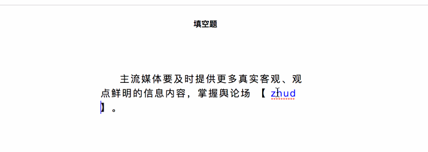

### 如何实现一个尺寸“听话”的多行文本输入框

### 一、前言

  &emsp;&emsp;通过创建 textarea 标签，并且指定其 rows 和 cols 属性，就可以创建一个多行文本输入框。

  &emsp;&emsp;但是当输入的内容超过指定的 rows 之后，就会出现滚动条，如果用户想要查看全部内容，那就必须来回的拖动滚动条。而且这个滚动条只有在用户滚动的时候才会出现，在一些情况下，用户可能并不知道该区域有更多的内容。

  &emsp;&emsp;通常情况下，为了给用户一个良好的体验，需要让这个多行文本输入框的高度自适应，从而避免滚动条带来的问题。


### 二、高度自适应

  &emsp;&emsp;实现高度自适应的文本输入框的思路很简单：监听输入相关的事件，获取到元素的内容高度，修改 textarea 的固定高度。

  &emsp;&emsp;其中涉及很多基础的知识，也就是我们常说的细节问题处理：

##### 1、scrollHeight

  &emsp;&emsp;scrollHeight 这个只读属性是一个元素内容高度的度量，包括由于溢出的视图中不可见的内容。

  &emsp;&emsp;scrollHeight 包含元素的 padding，但是不包含元素的 border 和 margin 。当元素中不存在溢出内容，则 scrollHeight 与 clientHeight 是相同的。

  &emsp;&emsp;接下来只要将获取到的 scrollHeight 属性值赋给元素样式中的 height 属性，是不是就可以动态的更改高度呢？当然，事情并没有那么简单，这里又要引出另一个基础知识点。

##### 2、box-sizing

  &emsp;&emsp;CSS 中的盒模型基本上是常考的一个知识点，CSS 中可以通过设置 box-sizing 属性值，从而更改盒模型高度和宽度的计算，下面以高度为例：

  - content-box：是默认值。如果你设置一个元素的高度为100px，意味着元素内容区域的高度为100px，如果再设置 padding 和 border ，那么最终元素的高度为 100px + border-top + border-bottom + padding-top + padding-bottom 。
  - border-box：如果你设置一个元素的高度为100px，则意味着元素的最终高度就是100px，而元素内容区域的高度为 100px - border-top - border-bottom - padding-top - padding-bottom 。

  &emsp;&emsp;由此可见，为元素设置样式中的 height 属性时，需要弄清楚元素的 box-sizing 、 padding 以及 border。

##### 3、getComputedStyle

  &emsp;&emsp;对于前端新手来说，要获取到元素样式的 box-sizing 属性值，可能第一时间会想到：

```JavaScript
  document.getElementById('demo').style.boxSizing
```

  &emsp;&emsp;但是大部分情况下，该属性获取的是空值，因为它只能够获取行内样式，如果 style 属性中并没有设置 boxSizing 属性值，那自然就是空值。

  &emsp;&emsp;在 CSS 中，开发者可以通过很多方式去设置元素的样式，并且它们的优先级各不相同，那么就需要一个 API 来确定元素最终的样式，而 Window.getComputedStyle() 方法正是因此而生。

  &emsp;&emsp;Window.getComputedStyle() 方法返回一个实时的 CSSStyleDeclaration 对象，通过调用其 getPropertyValue() 方法，获取相应的属性值：

```JavaScript
  const style = window.getComputedStyle(el)
  style.getPropertyValue('box-sizing')
```

##### 4、实现

  &emsp;&emsp;有了上述三个知识点的补充，接下来就是代码实现：

```JavaScript
function AutoSize (el) {
  if (!(this instanceof AutoSize)) {
    return new AutoSize(el)
  }
  if (!el) {
    throw new Error('element can not be empty')
  }
  if (typeof el === 'string') {
    el = document.querySelector(el)
  }
  this.el = el
  const attrs = ['box-sizing', 'padding-top', 'padding-bottom', 'border-top', 'border-bottom']

  // 初始化信息
  this.heightOffset = 0
  const style = window.getComputedStyle(el)
  const [boxSizing, paddingTop, paddingBottom, borderTop, borderBottom] = attrs.map(item => style.getPropertyValue(item))
  if (boxSizing === 'content-box') {
    this.heightOffset = -(parseFloat(paddingTop)) - parseFloat(paddingBottom)
  } else {
    this.heightOffset = parseFloat(borderTop)  + parseFloat(borderBottom)
  }
  this.initEvent()
}

AutoSize.prototype = {
  initEvent () {
    this.listener = this.handleAction.bind(this)
    this.el.addEventListener('input', this.listener, false)
  },
  destroy () {
    this.el.removeEventListener('input', this.listener, false)
    this.listener = null
  },
  handleAction (e) {
    const event = e || window.event
    const target = event.target || event.srcElement
    target.style.height = ''
    target.style.height = target.scrollHeight + this.heightOffset + 'px'
  }
}
```

  

  &emsp;&emsp;对于 input 这样高频度触发的事件，一般需要采用函数节流或者函数防抖的方式进行优化，这里就留给读者折腾吧。


### 三、contenteditable

  &emsp;&emsp;HTML 中还有一个很特别的属性 -- **contenteditable**，该属性可以规定当前元素是否可编辑（下文统称这样的元素为可编辑元素），该属性的取值有以下几种：

  - true 或者空字符串，表示元素是可以编辑的；
  - false 表示元素是不可编辑的；
  - plaintext-only 只处理文本内容；
  - 更多取值，请查看[W3C ContentEditable](https://w3c.github.io/editing/contentEditable.html#contenteditable-plaintext-only-state)。

  &emsp;&emsp;当用户向可编辑元素中输入内容时，浏览器会生成对应的 DOM 元素，所以可编辑元素可以做富文本编辑功能，例如：[medium-editor](https://github.com/yabwe/medium-editor)。

  &emsp;&emsp;但是由于各个浏览器对于标签的生成规则不同，兼容性方面的处理是很大的难题。

  &emsp;&emsp;现在回到实现高度自适应的多行文本输入框的需求上来，考虑到用户可能输入或者粘贴富文本内容，这里需要将 contenteditable 属性设置为 plaintext-only ：

```HTML
  <div contenteditable="plaintext-only" class="demo" id="js-div" data-placeholder="这是占位文字"></div>
```

  &emsp;&emsp;现在这个 div 标签变成了一个高度自适应的文本输入框，是不是很神奇！不过不要高兴的太早，还有需要考虑一些事情：

##### 1、placeholder

  &emsp;&emsp;对于一个正儿八经的输入框，是不是应该有一个 placeholder 效果啊：

```CSS
  [contenteditable=true]:empty::before {
    content: attr(data-placeholder);
    color: red;
    display: block;
  }
```

##### 2、value

  &emsp;&emsp;对于 textarea 标签，可以通过 value 属性值获取用户输入的内容。但是对于设置 contenteditable 属性的元素来说，就需要具体情况具体分析了：

  - 如果需要获取 HTML 结构，那么就需要采用 innerHTML 属性；
  - 如果仅仅获取文本内容，那么可以考虑 innerText 和 textContent。

  &emsp;&emsp;innerText 和 textContent 是不是又让你傻傻分不清了，关于它们的区别主要有：

  - textContent 会获取所有元素的内容，包括 script 和 style 标签元素，而 innerText 不会；
  - innerText 受 CSS 样式的影响，不会返回隐藏元素的文本，而 textContent 会；
  - innerText 返回的文本内容会格式化。

  &emsp;&emsp;由于上述 contenteditable 属性指定了 plaintext-only 属性值，所以这三种属性获取到的值是一样的。

##### 5、禁止富文本输入的其它方式

  &emsp;&emsp;除了指定 plaintext-only 属性值的方法，**张鑫旭大神**在很多年前写过一个[div 模拟 textarea 实现高度自适应](https://www.zhangxinxu.com/study/201012/div-textarea-height-auto.html)，其中是通过 CSS 属性实现只允许输入文本内容：

```CSS
  -webkit-user-modify: read-write-plaintext-only;
```

  &emsp;&emsp; 如今 user-modify 这个 CSS 属性已经被 contenteditable 替代了，不过这依然是一个很神奇的 CSS 属性。

  &emsp;&emsp;到此，才算实现一个高度自适应的多行文本输入框。不过仍然有很多奇怪的问题，欢迎踩过这方面坑的同学留言讨论。

##### 5、填空题输入框的实现

  &emsp;&emsp;除了实现高度自适应的多行文本输入框之外，可编辑元素与 input 和 textarea 标签还有一个很大的不同，它可以完美的融入到文本当中，例如实现这样一个填空题输入框的效果：

  

### 四、总结

  &emsp;&emsp;以上便是高度自适应多行文本输入框的两种实现方式：

  - scrollHeight + getComputedStyle + input(事件)
  - contenteditable + 一堆骚操作

  &emsp;&emsp;相比较后者，前者的适用性更强，也是大部分组件库所采用的方式。