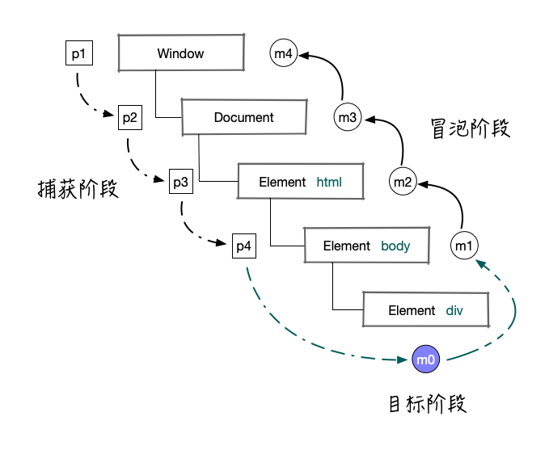

### 前端小贴士 - 事件流与事件处理程序

### 一、什么是事件流？

  &emsp;&emsp;事件流描述的是页面中接受事件的顺序。IE的事件流是事件冒泡流，Netscape的事件流是事件捕获流。

  &emsp;&emsp;DOM2级事件中规定了事件流包括：事件捕获阶段、处于目标阶段和事件冒泡阶段。

  

### 二、DOM0级事件处理程序

  &emsp;&emsp;DOM0级事件主要通过on+事件名称(小写字母)的方式指定事件处理程序，例如：

```JavaScript
  const el = document.getElementById('js-btn')
  el.onclick = function () {
    console.log('clicked')
  }
```

  &emsp;&emsp;这种方式具有跨浏览器的优势，但是对于任意事件只能指定一个事件处理程序。

  &emsp;&emsp;通过将事件处理程序置为null的方式删除该事件的事件处理程序：

```JavaScript
  el.onclick = null
```

### 三、DOM2级事件处理程序

  &emsp;&emsp;DOM2级事件定义了两个方法：

  - addEventListener(name, callback, useCapture)注册事件处理程序，相比较DOM0，可以注册多个事件处理程序。
  - removeEventListener(name, callback, useCapture)移除指定事件处理程序。

```JavaScript
  const el = document.getElementById('js-btn')
  function handleClick () {
    // TODO
  }
  el.addEventListener('click', handleClick, false)
  el.removeEventListener('click', handleClick, false)
```

  &emsp;&emsp;特别需要注意调用removeEventListener()方法时，必须传入具体的函数名。如果事件处理程序为匿名函数，则无法移除。

### 四、IE中的事件处理程序

  &emsp;&emsp;IE实现了类似DOM2级中的两个方法：

  - attachEvent(name, callback)，注册事件处理程序。
  - detachEvent(name, callback)，移除事件处理程序。

  &emsp;&emsp;记住是类似的两个方法，下面是它与DOM2级事件处理程序的差异性：

  - IE传入的name必须是on+事件名(小写字母)，DOM2中则是直接为事件名。
  - IE不支持useCapture参数，所以事件处理程序都是注册在事件冒泡阶段。
  - IE事件执行的顺序与注册的顺序是相反的，DOM2中则是相同的。
  - IE事件对象作为window对象的一个属性存在，DOM2中则是浏览器在事件执行的时候传入。
  - IE事件目标通过event.srcElement获取，DOM2中通过event.target获取。
  - IE通过returnValue属性阻止默认事件行为，DOM2中通过preventDefault方法。
  - IE通过cancelBubble属性阻止事件冒泡，DOM2中通过stopPropagation方法。

### 五、跨浏览器的事件处理

  &emsp;&emsp;为了以跨浏览器的方式处理事件，需要对方法和属性进行检测，封装一个统一的API:

```JavaScript
const EventUtil = {
  addHandler (el, type, handle) {
    if (el.addEventListener) {
      el.addEventListener(type, handle, false) // 采用普遍支持的冒泡处理
    } else if (el.attachEvent) {
      el.attachEvent(`on${type}`, handle)
    } else {
      el[`on${type}`] = handle // 如果两种方式都不支持，只能采用DOM0级事件处理
    }
  },
  removeHandle (el, type, handle) {
    if (el.removeEventListener) {
      el.removeEventListener(type, handle, false)
    } else if (el.detachEvent) {
      el.detachEvent(`on${type}`, handle)
    } else {
      el[`on${type}`] = null
    }
  },
  getEvent (event) {
    return event ? event.target : window.event
  },
  getTarget (event) {
    return event.target || event.srcElement
  },
  preventDefault (event) {
    if (event.preventDefault) {
      event.preventDefault()
    } else {
      event.returnValue = false
    }
  },
  stopPropagation (event) {
    if (event.stopPropagation) {
      event.stopPropagation()
    } else {
      event.cancelBubble = true
    }
  }
}
```

### 六、总结

  &emsp;&emsp;在前端开发的过程中，少不了与事件处理打交道，那么理解DOM事件流和能够写出兼容性的事件处理程序代码是必不可少的。


###### 参考资料

- 《JavaScript高级程序设计（第三版）》