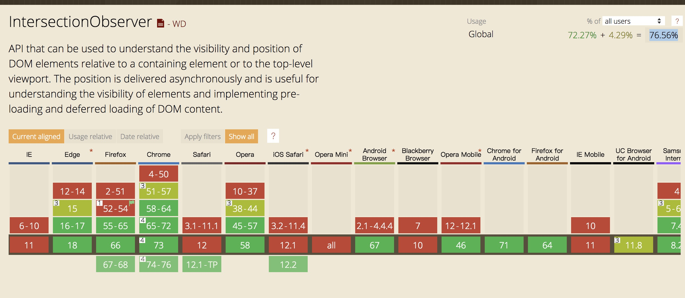

### 图片懒加载的前世今生

### 一、前言

  &emsp;&emsp;通常情况下，HTML 中的图片资源会自上而下依次加载，而部分图片必须得用户向下滚动页面才能被看见，否则永远也不会被看见，那么这部分图片的流量就被白白浪费了。

  &emsp;&emsp;所以，对于那些含有大量图片资源的网站，采用“按需加载”的方式，也就是当图片资源出现在可视区域内，才会被加载，这样可能会影响一丢丢用户体验，但是能大大节省网站的流量。

  &emsp;&emsp;而上述“按需加载”的方式就是今天的主角 -- 图片懒加载技术

### 二、原理

  &emsp;&emsp;图片懒加载技术主要通过监听图片资源容器是否出现在可视区域内，来决定图片资源是否被加载。

  &emsp;&emsp;那么实现图片懒加载技术的核心就是如何判断元素处于可视区域之内。

### 三、前世

  &emsp;&emsp;第一种思路：通过 scroll 事件监听用户滚动行为，再将判断元素与视口关系的函数指定为 scroll 事件的处理程序，从而实现图片懒加载的效果。

##### 1、scroll 事件

  &emsp;&emsp;scroll 事件可能会被高频度的触发，而按照上述思路，必然会在 scroll 事件处理程序中出现大量的 DOM 操作，这很可能会影响页面的卡顿，这时就需要降低重型操作的频率。

  &emsp;&emsp;上述这种优化的方式叫做函数节流，在 JavaScript 中可以采用 setTimeout + 闭包的方式实现：

```JavaScript
function throttle (fn, interval = 500) {
  const _fn = fn
  let timer = null
  let firstTime = true

  return function (...args) {
    const self = this
    if (firstTime) {
      // 第一次加载
      _fn.apply(self, args)
      return firstTime = false
    }

    if (timer) {
      // 定时器正在执行中，跳过
      return
    }

    timer = setTimeout(() => {
      clearTimeout(timer)
      timer = null
      _fn.apply(self, args)
    }, interval)

  }
}
```

  &emsp;&emsp;除了上述 setTimeout 的实现方式，还可以通过 window.requestAnimationFrame() 方法实现，这里不再赘述，有兴趣的同学可以自己尝试尝试。

##### 2、getBoundingClientRect()方法

  &emsp;&emsp;JavaScript 提供 Element.getBoundingClientRect() 方法返回元素的大小以及相对于视口的位置，这里会用到返回对象的四个属性：

  - top 和 left 是元素左上角坐标与网页左上角坐标的差值；
  - width 和 height 是元素自身的宽度和高度。

  &emsp;&emsp;再结合视口的高度和宽度，即可判断元素是否出现在可视区域内：

```JavaScript
function isElementInViewport (el) {
  const { top, height, left, width } = el.getBoundingClientRect()
  const w = window.innerWidth || document.documentElement.clientWidth
  const h = window.innerHeight || document.documentElement.clientHeight
  return (
    top <= h &&
    (top + height) >= 0 &&
    left <= w &&
    (left + width) >= 0
  )
}
```

##### 3、实现

  &emsp;&emsp;接下来在实现图片懒加载的过程中，还需要注意一些小问题：

  - scroll 事件只有在滚动行为发生时，才会被触发，这里需要手动加载一次首屏的图片；
  - 利用 addEventListener 注册事件处理程序时，需要保存事件处理程序的引用，以便销毁注册的事件；
  - 对于 img 标签和 backgroundImage 属性需要分别处理。

```JavaScript
function LazyLoad (el, options) {
  if (!(this instanceof LazyLoad)) {
    return new LazyLoad(el)
  }

  this.setting = Object.assign({}, { src: 'data-src', srcset: 'data-srcset', selector: '.lazyload' }, options)

  if (typeof el === 'string') {
    el = document.querySelectorAll(el)
  }
  this.images = Array.from(el)

  this.listener = this.loadImage()
  this.listener()
  this.initEvent()
}

LazyLoad.prototype = {
  loadImage () {
    return throttle(function () {
      let startIndex = 0
      while (startIndex < this.images.length) {
        const image = this.images[startIndex]
        if (isElementInViewport(image)) {
          const src = image.getAttribute(this.setting.src)
          const srcset = image.getAttribute(this.setting.srcset)
          if (image.tagName.toLowerCase() === 'img') {
            if (src) {
              image.src = src
            }
            if (srcset) {
              image.srcset = srcset
            }
          } else {
            image.style.backgroundImage = `url(${src})`
          }
          this.images.splice(startIndex, 1)
          continue
        }
        startIndex++
      }
      
      if (!this.images.length) {
        this.destroy()
      }
    }).bind(this)
  },
  initEvent () {
    window.addEventListener('scroll', this.listener, false)
  },
  destroy () {
    window.removeEventListener('scroll', this.listener, false)
    this.images = null
    this.listener = null
  }
}
```

### 四、今生

  &emsp;&emsp;现在，Web为开发者提供了 IntersectionObserver 接口，它可以异步监听目标元素与其祖先或视窗交叉状态，并且这个接口是异步的，不随着目标元素的滚动同步触发。

  &emsp;&emsp;IntersectionObserver 构造函数接收两个参数，回调函数以及配置参数。

##### 1、配置参数

  &emsp;&emsp;配置参数有以下三个：

  - root：所监听对象的具体祖先元素，默认是 viewport ；
  - rootMargin：计算交叉状态时，将 margin 附加到祖先元素上，从而有效的扩大或者缩小祖先元素判定区域。
  - threshold：设置一系列的阈值，当交叉状态达到阈值时，会触发回调函数。

##### 2、回调函数

  &emsp;&emsp;IntersectionObserver 实例执行回调函数时，会传一个包含 IntersectionObserverEntry 对象的数组，该对象一共有七大属性：

  - time：返回一个记录从 IntersectionObserver 的时间原点到交叉被触发的时间的时间戳；
  - target：目标元素；
  - rootBounds：祖先元素的矩形区域信息；
  - boundingClientRect：目标元素的矩形区域信息，与前面提到的 Element.getBoundingClientRect() 方法效果一致；
  - intersectionRect：祖先元素与目标元素相交区域信息；
  - intersectionRatio：返回intersectionRect 与 boundingClientRect 的比例值；
  - isIntersecting：目标元素是否与祖先元素相交。

##### 3、实现

  &emsp;&emsp;在此之前，还需要了解 IntersectionObserver 实例方法：

  - observe：开始监听一个目标元素；
  - unobserve：停止监听特定的元素；
  - disconnect：使 IntersectionObserver 对象停止监听工作；
  - takeRecords：为所有监听目标返回一个 IntersectionObserverEntry 对象数组并且停止监听这些目标。

  &emsp;&emsp;以下为实现代码：

```JavaScript
function LazyLoad (images, options = {}) {
  if (!(this instanceof LazyLoad)) {
    return new LazyLoad(images, options)
  }
  this.setting = Object.assign({}, { src: 'data-src', srcset: 'data-srcset', selector: '.lazyload' }, options)
  this.images = images || document.querySelectorAll(this.setting.selector)
  this.observer = null
  this.init()
}

LazyLoad.prototype.init = function () {
  let self = this
  let observerConfig = {
    root: null,
    rootMargin: '0px',
    threshold: [0]
  }
  this.observer = new IntersectionObserver(entries => {
    entries.forEach(entry => {
      const target = entry.target
      if (entry.intersectionRatio > 0) {
        this.observer.unobserve(target)
        const src = target.getAttribute(this.setting.src)
        const srcset = target.getAttribute(this.setting.srcset)
        if ('img' === target.tagName.toLowerCase()) {
          if (src) {
            target.src = src
          }
          if (srcset) {
            target.srcset = srcset
          }
        } else {
          target.style.backgroundImage = `url(${src})`
        }
      }
    })
  }, observerConfig)

  this.images.forEach(image => this.observer.observe(image))
}
```

### 五、总结

  &emsp;&emsp;到此，实现图片懒加载有两种方法：

  - 监听 scroll 事件，通过 getBoundingClientRect 计算目标元素与视口的交叉状态；
  - IntersectionObserver 接口。

  &emsp;&emsp;第二种方法更加省心，到目前为止兼容性也还行：

  

  &emsp;&emsp;相比较下，第一种方法需要从各个方面去优化 scroll 事件，从而让滚动滚动“如丝般顺滑”。

  &emsp;&emsp;最后，放上两篇关于滚动优化的文章。

  - [百度外卖前端 如何不择手段提升scroll事件的性能](https://zhuanlan.zhihu.com/p/30078937)
  - [高性能滚动 scroll 及页面渲染优化](https://www.cnblogs.com/coco1s/p/5499469.html)