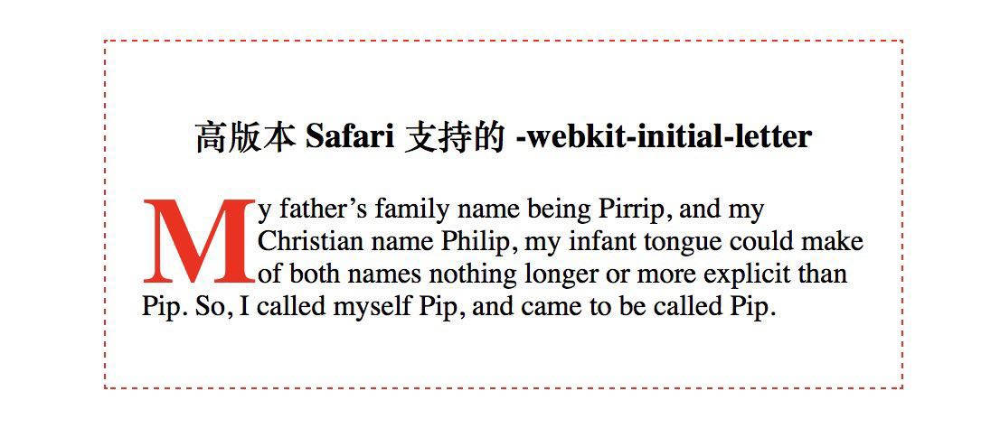
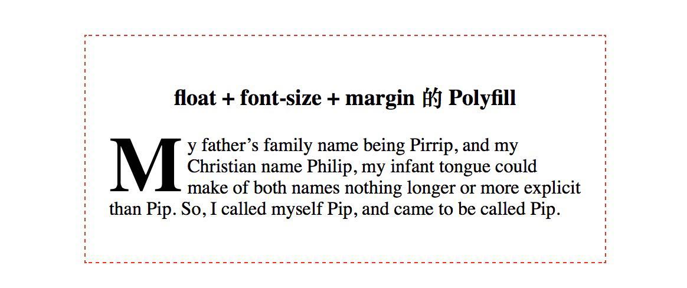

# 实现首字下沉样式

### 一、前言

  &emsp;&emsp;在阅读报纸或者杂志时，文章开头第一段话的第一个字的字号特别大，并且伴有下沉显示，这种样式就叫做首字下沉。

  &emsp;&emsp;首字下沉样式既醒目又具有一定的美感，那么对于一个前端开发者，该如何实现呢？

### 二、initial-letter

  &emsp;&emsp;CSS 的 initial-letter 属性可以实现首字下沉的效果，但是遗憾的是：目前只有高版本的 Safari支持该属性。

```CSS
p::first-letter {
  -webkit-initial-letter: 3;
  text-transform: uppercase;
  color: red;
  font-weight: bold;
}
```

  &emsp;&emsp;效果如下：

  

### 三、float + margin 的 Polyfill 方案

  &emsp;&emsp;对于不支持 initial-letter 属性的浏览器，可以采用 float + margin 的 Polyfill 方案，以下面的 HTML 结构为例：

```HTML
<div class="container">
  <p class="demo2">My father’s family name being Pirrip, and my Christian name Philip, my infant tongue could make of both names nothing longer or more explicit than Pip. So, I called myself Pip, and came to be called Pip.</p>
</div>
```

  &emsp;&emsp;现在要实现一个跨3行的首字下沉效果，首先需要预估一下这个首字符的字体大小，由于本身段落文本还有一些行间距，那么假设首字符的字体大小为 410%。

  &emsp;&emsp;第二步，需要通过 float 属性让首字符左浮动。

  &emsp;&emsp;接下来，看一下英文字符的排版：

  

  &emsp;&emsp;通常设置的 font-size 属性的大小就是上述图片中字母占据的高度，但是由上路可以发现大部分字母集中在 x-height 区域内，当字体的大小越来越大时，它上下的留白也会越来越大，这样会影响首字符的显示效果，这里需要采用垂直方向的负 margin 来减少留白区域：

```CSS
.demo2::first-letter {
  font-size: 410%;
  font-weight: bold;
  float: left;
  text-transform: uppercase;
  margin: -12px 4px -20px 0;
}
```

  &emsp;&emsp;实现的效果为：

  

  &emsp;&emsp;有兴趣的同学可以对比一下没有采用负 margin 的实现效果。

### 四、JavaScript 实现方案


