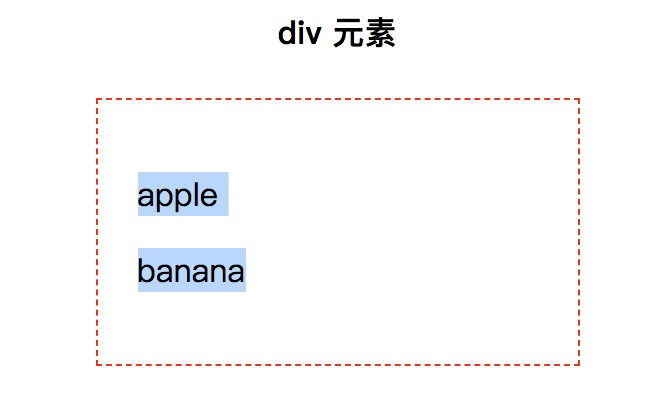

# JavaScript 模拟用户的复制操作

### 一、前言

  &emsp;&emsp;用户在浏览网页的过程中执行复制操作的场景是非常多的，例如：复制链接地址、复制分享文案等等。

  &emsp;&emsp;为了优化用户的操作体验，那么就需要深入研究复制操作的机制。

  &emsp;&emsp;复制操作可以分为如下两部分：

  - 选中文本：用户通过鼠标选中文本的操作。
  - 操作系统剪贴板：用户按下 Ctrl（command） + C 的操作。


### 二、选中文本

  &emsp;&emsp;首先，读者需要明白并不是所有的文本都可以被选中的（后续会提到），笔者这里先介绍几个比较容易理解的情况：

##### 1、input 和 textarea

  &emsp;&emsp;由于 input 元素的工作方式因其类型属性的值而有很大的差异，所以这里只讨论 text 的情况。

  &emsp;&emsp;由于 JavaScript 提供了 HTTMLInputElement.select() 方法，所以选中 textarea 和 input 中的内容就变得非常简单：

```JavaScript
  document.querySelector('input').select()
```

  

##### 2、div

  &emsp;&emsp;div 元素并没有 select() 方法，这就需要读者了解一个新的对象： Selection 。

  &emsp;&emsp;Selection 对象表示用户选择文本的范围以及光标的范围。关于 Selection 对象，读者需要了解以下几个术语：

  - 锚点：选区的起始点。
  - 焦点：选区的终止点。
  - 范围：文档中**连续**的一部分。

  &emsp;&emsp;与 Selection 对象息息相关的还有一个 Range 对象，它主要用来定义选区的信息。对于这两个对象不了解的读者，可以查看[MDN](https://developer.mozilla.org/zh-CN/docs/Web/API/Selection)，接下来，利用 Selection 和 Range 对象实现上述 select() 方法的效果：

```JavaScript
  const selection = window.getSelection()
  const range = document.createRange()
  range.selectNodeContents(document.querySelector('div'))
  selection.removeAllRanges()
  selection.addRange(range)
```

  

### 三、操作系统剪贴板

  &emsp;&emsp;document 暴露的 execCommand 方法，可以用来运行操作系统提供的命令，并且这些命令大部分作用于 Selection 对象。

  &emsp;&emsp;该方法返回的布尔值表示操作是否被支持或者是否被启用，但是调用一个命令之前，不能尝试使用返回值去校验浏览器的兼容性。

```JavaScript
  function copyText () {
    let success = true
    try {
      success = document.execCommand('copy')
    } catch (e) {
      success = false
    }
    return success
  }
```

  &emsp;&emsp;通过 execCommand 执行 copy 命令，将上述选中的文本添加到系统剪贴板中，接下来用户只需要在使用的地方按下 Ctrl（command） + V 即可粘贴该内容。

### 四、特殊情况的处理

  &emsp;&emsp;在 HTML 中部分元素中的文本是无法被选中的，例如：

```HTML
  <select id="js-select">
    <option value="apple">apple</option>
    <option value="banana">banana</option>
    <option value="peach">peach</option>
  </select>
```

  &emsp;&emsp;既然 select 元素中的文本无法被选中，那么就无法调用 execCommand 方法，又何谈模拟用户复制该文本呢？

  &emsp;&emsp;这里需要采用一个常用的套路：创建一个对用户透明的元素完成一系列的操作。

##### 1、获取的需要复制的文本

  &emsp;&emsp;首先获取到需要复制的文本内容，对于 select 元素，其文本内容可以根据 value 属性获取：

```JavaScript
  const element = document.getElementById('js-select')
  const text = element.value
```

##### 2、创建透明元素

  &emsp;&emsp;前面提到的 input、textarea 等元素都是可以被选中的，所以这里笔者选择创建一个透明的 textarea 来实现接下来的功能：

```JavaScript
  function createFakerElement (text) {
    const fakerElement = document.createElement('textarea')
    fakerElement.style.position = 'absolute'
    fakerElement.style.left = '-9999px'
    fakerElement.value = text
    document.body.appendChild(fakerElement)

    return fakerElement
  }
```

##### 3、选中文本

  &emsp;&emsp;前面也提到选中文本有两种方式：

  - 对于 input、textarea 元素，可以直接调用其 select 方法。
  - 对于大多数元素（这里的 select 元素就是特例），可以通过 Selection 和 Range 完成选中文本的操作。

  &emsp;&emsp;由于上述创建的是 textarea，这里直接调用 select 方法：

```JavaScript
  function selectInput (element) {
    return element.select()
  }
```

##### 4、操作系统剪贴板

  &emsp;&emsp;前文已经提及，这里不再赘述。

  &emsp;&emsp;接下来只要按照顺序执行这些操作即可：

```JavaScript
  document.getElementById('js-button').addEventListener('click', () => {
    const element = document.getElementById('js-select')
    // 1、获取需要的文本内容
    const text = element.value

    // 2、创建透明的 textarea 元素
    const fakerElement = createFakerElement(text)

    // 3、选中相应的文本
    selectInput(fakerElement)

    // 4、执行操作系统剪贴板的 copy 命令
    const success = copyText()

    if (success) {
      console.log('复制成功')
    } else {
      console.log('复制失败')
    }

    document.body.removeChild(fakerElement)
  }, false)
```


[select.js](https://github.com/zenorocha/select)
[clipboard.js](https://github.com/zenorocha/clipboard.js)
